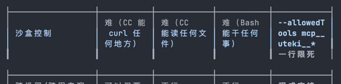

# 03 · MCP vs Script/HTTP/Direct — agent 认知层的差别

> 把"为什么用 MCP"这个问题想清楚，比"怎么写 MCP server"重要 10 倍。
> 这份文档记录一次设计对话的结论，作为后续选型的参照。

## 一、问题的提法

如果 uteki 后端和 Claude Code 都在同一台 localhost 机器上，"让 CC 操作 uteki"至少有 4 条路：

1. **HTTP API + curl**：CC 用 Bash 工具直接 `curl http://localhost:8000/...`
2. **SQLite + 文件直读**：CC 用 Read 工具直接读 `data/uteki.db` + `data/runs/...`
3. **Shell script**：包一层 `scripts/uteki-run.sh research "..."`，CC 通过 Bash 调
4. **MCP**：写一个 MCP server adapter，CC 把 uteki 当 native tool 调

技术上**都能办到事**。区别不在传输层，在 CC 的**推理层**。

## 二、4 种方案在真实使用维度上的对比

| 维度 | curl | SQLite/文件直读 | Script | **MCP** |
|---|---|---|---|---|
| 能调起 run | ✓ | ✗ (只读) | ✓ | ✓ |
| 能读 artifact | ✓ | ✓ | ✓ | ✓ |
| **CC 主动发现工具** | ✗ 要先读 README | ✗ 要知道 schema | ✗ 要列脚本 | **✓ 启动即注入 CC 上下文** |
| **参数有 schema** | API 文档里有但 CC 看不见 | DB schema | 要解析 `--help` | **✓ JSON Schema 在 tool list 里** |
| **返回是结构化的** | JSON ✓ | rows ✓ | stdout 文本，CC 要解析 | **✓ 结构化 result** |
| **CC 模型对调用形式熟悉度** | 中（要 curl） | 低 | 中（Bash） | **高（tool_use 是训练分布内）** |
| 多步链式调用的易写程度 | 一般 | 难 | 一般 | **极易** |
| 沙盒控制 | 难 | 难 | 难 | **`--allowedTools mcp__uteki__*` 一行限死** |
| 跨机器/跨用户演化 | 可以但要重做 auth | 不行 | 不行 | **现成支持** |

把 ✓ 收掉之后会发现，**MCP 唯一不可替代的两点是 CC 推理层的、不是功能性的**：

1. **CC 看得见 uteki 的能力，不用先 `cat README`** —— 这就改变了 CC 主动想到用 uteki 的概率
2. **CC 模型训练时就学过怎么用 MCP 风格的 tool** —— `tool_use` 是 Claude 的母语之一，curl 不是

## 三、关键认知：谁是 agent？

这是这次讨论最值钱的部分。

### Script 方案下的"自主"

```
[crontab: 每 6 小时]
$ bash scripts/auto-review.sh
  ├─ curl /api/runs?since=6h ago
  ├─ for each run:
  │    grep eval-report.json '"decision": "revise"'
  │    if match:
  │       claude -p "review run $run_id and ..."   ← 这里 CC 接手
  │       └─ CC 在 well-defined 窗口内做完一个任务后退出
  └─ done
```

**脚本是 agent，CC 是脚本调用的一个 LLM 子例程**。脚本控制循环、判断、超时。CC 在脚本提供的窗口内完成被指派的任务。

### MCP 方案下的"自主"

```
[crontab 或长驻 daemon]
$ claude --mcp-config uteki.json -p "$(cat .claude/commands/auto-review.md)"
  └─ CC 持续运行，在它的 reasoning loop 里：
     ├─ [tool] mcp__uteki__list_recent_runs(since="6h")     ← CC 主动决定调
     ├─ [tool] mcp__uteki__read_artifact(run_id, "eval-report.json")
     ├─ 读完 reasoning: "这个 run 评分低，我应该深入看"
     ├─ [tool] mcp__uteki__read_artifact(run_id, "final-research.md")
     ├─ [tool] Write(file="proposals/...", content=critique)
     ├─ [tool] mcp__uteki__list_recent_runs(since="0h", skill="earnings")
     └─ ... CC 自己决定下一步是什么
```

**CC 就是 agent，uteki 是 CC 调用的领域工具**。脚本只是一次性引信。CC 控制循环、判断、何时停。

### 这个区别决定了能做什么

| Script 方案能做的 | MCP 方案能做的 |
|---|---|
| 一次性任务 | 一次性任务 |
| 已知工作流的批处理 | 已知工作流的批处理 |
| | **由 CC 自己设计工作流** |
| | **跨工作流的链式判断** |
| | **混合多个 MCP 来源的工具**（uteki + git + slack...）|

最后一行是真正的解锁。你以后给 CC 接一个 Slack 的 MCP、一个 GitHub 的 MCP、一个 uteki 的 MCP，CC 就能：「这个 run 的评估不达标→开个 uteki proposal → 提个 GitHub draft PR → 在 Slack 通知运营」——全在一次 CC 会话里自主完成。Script 方案做这个需要预先编排，CC 是被动的拼图块。

## 四、什么时候 MCP **不**值得

诚实记下来：

- **一次性、确定性的命令**——`uv run pytest` 这类。直接 Bash 工具就好。
- **不需要 CC 推理的纯数据查询**——比如 `SELECT count(*) FROM runs`，curl 就行。
- **CC 不会重复用到的能力**——一次性 hack，包脚本更轻。
- **超低延迟交互**——MCP 走 stdio JSON-RPC 有 ~10ms 开销，对一般工具调用无所谓，但对高频小操作有累积成本。

**会值得的判据**：这个能力 CC 是否会**多次、可能在不同会话里、可能在自主决策时主动选择**调用？是 → MCP。否 → script 或 Bash。

uteki 的 skill 调用、artifact 读取属于"会值得"——CC 会反复用。

## 五、对 uteki 实施路径的影响（计划修正）

之前我说"Step 0 是 SQLite RunStore 持久化，是 MCP 的硬阻塞"。**这个判断不准。**

阻塞只在一种情况下成立：MCP server 直接 import uteki 内部模块、自己跑 harness。那确实需要跨进程共享 store。

**但 MCP server 完全可以做成 uteki HTTP API 的薄包装**：

```
                         ┌──── (MCP-CC 走这边) ────┐
                         │                          │
   ┌────────┐     ┌──────┴──────┐      ┌──────────┐│
   │   CC   │ ──→ │ MCP server  │ ──→  │  uteki   │
   │        │     │ (stdio,     │ HTTP │  HTTP    ││
   │        │     │  ~200 LOC)  │      │  API     ││
   └────────┘     └─────────────┘      └──────────┘│
                                            ▲      │
                              browser/eval ──┘      │
                              都通过 HTTP API       │
                         ──────────────────────────┘
```

这样 MCP server：
- **不 import** uteki 内部
- **不需要** 跨进程共享 RunStore
- **HTTP API 是 SSOT**，所有客户端（浏览器、CC、移动端、eval）平等
- ~200 LOC 就能写完

代价：
- HTTP roundtrip 开销（localhost ~1ms，无感）
- MCP server 要 hardcode 一个 service-account token（dev 阶段：demo@local 的 token）
- 用户隔离边界在 HTTP API 层不变（MCP server = 一个 user）

收益：
- **MCP MVP 不需要 SQLite 持久化**
- 与现有架构零冲突
- 后续真要 SQLite 持久化（仍然在 ROI 列表第一）是独立工作

**这是这次讨论的可执行结论**——MCP 不阻塞 SQLite，反之亦然。

## 六、记一笔：什么时候回头补 SQLite

SQLite 持久化的必要性不来自 MCP，来自这三件事：

1. uteki HTTP server 进程重启时，所有 in-flight + 历史 runs 在内存里丢光
2. 想做 eval drift 趋势分析需要历史 run 跨进程留痕
3. iOS/Android 客户端要求会话能跨设备恢复（M4 后续）

所以 SQLite 还是 ROI #1，但**和 MCP 独立**。先 MCP，后 SQLite，互不影响。

## 七、给未来 CC 看的一句话总结

> 当一个能力需要被 CC 多次、自主、可能在跨会话场景下选用时，把它做成 MCP；
> 当只是脚本化一个确定性 workflow 时，shell 脚本就够了。
>
> MCP 不是更好的 HTTP，是让 CC **认识** 你的能力的协议。


